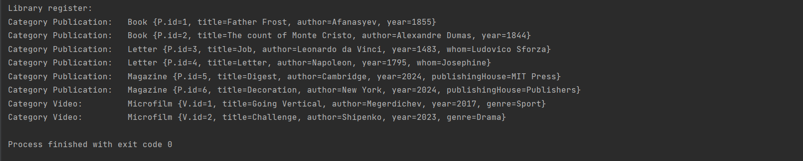

# Задание №1

Цель задания:
Проверить ваши знания проектирования классов и методов
Проверить ваше умение на практике применять принципы наследования, полиморфизма и инкапсуляции
Формулировка задачи:
Итак вы реализуете библиотечный реестр - абстракция предназначенная для описания библиотечного фонда 
муниципалитета вашего города. В этом фонде хранятся разные объекты: книги, журналы, письма, микрофильмы и т.д. 
Так же вам необходимо будет реализовать сервис обеспечивающий поиск среди всех объектов по инвентарному 
номеру и/или автору. Ваш main класс должен инициализировать реестр (генерировать экземпляры объектов), 
инициализировать сервис поиска и выводить на экран найденные элементы.

=================================================================================================================

## Задача реализована с применением MVC.

Демонстрация вывода на экран:
-----------

- Поиск среди всех объектов реестра по существующему ID:

-----------------

- Поиск среди всех объектов реестра по существующему АВТОРУ:

-----------------

- Поиск среди всех объектов реестра по несуществующему ID/АВТОРУ:

-----------------

Вывод на экран всего реестра:

